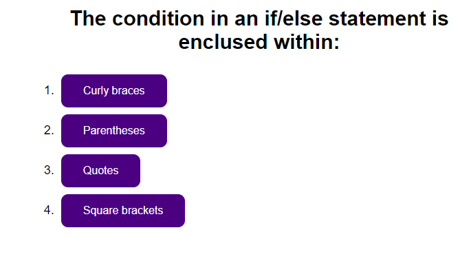

# CodeQuiz

A seven question quiz. Players start with 10 points. Answering a question correctly nets 2 points, while answering a question incorrectly loses 1 point and 10 seconds from the timer.

See deployment [here](https://jareddaniel95.github.io/CodeQuiz/).